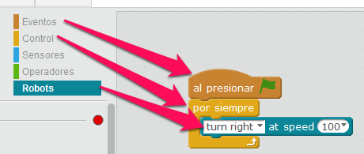
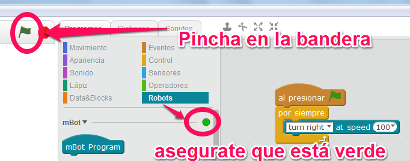

# A jugaaarrr ...

¿Lo probamos? venga!!! monta este sencillo programa. Las flechas te indican dónde está cada instrucción :

Y dale a la bandera :

Fuente de las imágenes: Capturas de pantalla mBlock

y como decía Joaquín Prat en el **precio justo** **A jugaaarr !!** (si entiendes esto último, es que tienes la edad óptima para aprender a programar ;)

Fuente [http://lossesentas-mispersonajes.blogspot.com.es/2015/08/joaquin-prat.html](http://lossesentas-mispersonajes.blogspot.com.es/2015/08/joaquin-prat.html)

