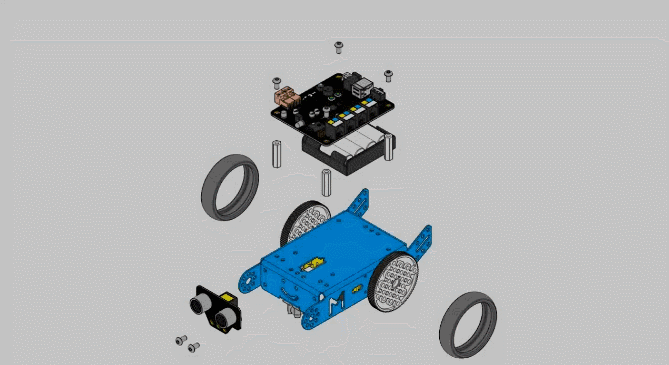
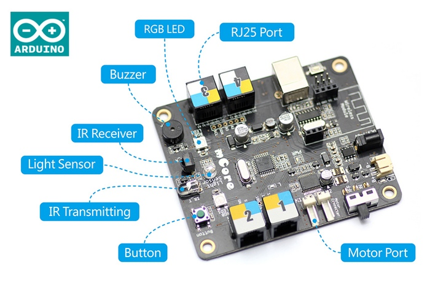
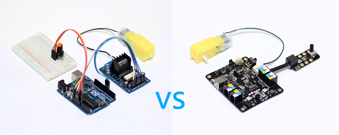

# Arduino: El corazón de mBot

El kit es fácil de montar ([instrucciones](https://www.dropbox.com/s/kwfo7pjdjoyo2x3/mBot%20instruction.pdf?dl=1)), pero si nos fijamos el corazon es la placa de Arduino:

**Fuente: [http://makeblock.es/](fuente:%20http://makeblock.es/)**

Nos tenemos que fijar en estos componentes de la placa:

**Fuente: [http://makeblock.es/](fuente:%20http://makeblock.es/)**

- Los R25 donde montaremos los diferentes componentes externos, tienen colores para indicar qué componentes son compatibles.
- **Transmisor de Infra Rojos** para interactuar con el mando a distancia, un elemento de interacción, pero ojo: común a todos los robots que estén en el aula
- **Botón** que permitirá interactuar
- Puertos de motor, donde conectaremos los motores de las ruedas.
- **Buzzer** o pequeño altavoz, no puede hacer maravillas, sólo tonos simples
- RGB Led o luces de los tres colores básicos.
- **Light Sensor** o sensor de luz, que nos servirá como otra vía de interacción.
- También tiene una conexión USB para conectarse con el ordenador con un cable.
<ul>
- Esta conexión USB a la vez proporciona energía. Es una opción a considerar si se nos ha agotado las pilas y queremos seguir programando.
- La conexión USB funciona también como cargador si en vez de pilas usamos [la batería Litio](http://www.makeblock.es/productos/bateria_3.7_mbot/)

La ventaja de esta placa es que permite conectar **directamente** los motores y diferentes componentes exteriores sin necesidad de placas controladoras intermedias y con la conexión rápida RJ25, sin necesidad de placas Protoboard, mirar la diferencia entre trabajar con una placa Arduino convencional y esta:

**Fuente: [http://makeblock.es/](fuente:%20http://makeblock.es/)**

