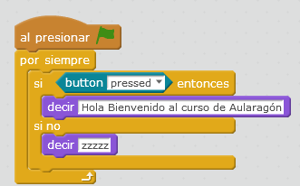

# Botón

¿Qué haría este programa? Pruébalo ¿por donde sale el mensaje?

**Fuente: Captura de pantalla mBlock. Programa: el autor.**

El botón es un elemento de interacción a tener en cuenta, aunque como veremos más adelante es más útil usar el teclado del PC.

siempre es típico que el primer programa en un curso de programación sea un "Hola Mundo" pero lo hemos personalizado

