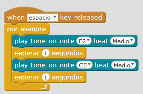

# Buzzer

Este simpático zumbador nos da algo de juego, podemos cambiar la nota como la duración, vamos a probar esta sirena:

**Fuente: Captura de pantalla mBlock. Programa: el autor.**

Al ejecutarlo, sólo hará la sirena si pulsamos la tecla espacio. Para pararlo hay que pulsar el círculo rojo que hay al lado de la bandera

[Aquí ](http://forum.makeblock.cc/t/changing-notes-on-the-speaker/2153)podemos conseguir un tono creciente

Y para los más frikis ;) ...

https//www.youtube.com/watch?v=oWfT9Yyl4tA
De [http://juegosrobotica.es/musica-con-mbot/](http://juegosrobotica.es/musica-con-mbot/)

Si alguien lo hace,[ por favor que lo cuelgue en el muro !](https://padlet.com/CATEDU/mBot)

