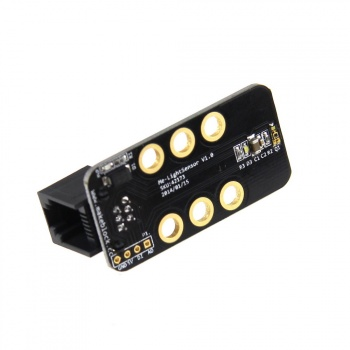
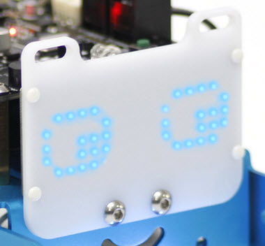

# Componentes exteriores

Componentes exteriores importantes a la hora de programar y que trataremos en este curso son:

- [Sensor de Línea](http://www.makeblock.es/productos/sensor_luz_y_escala_grises/) para utilizarlo por ejemplo como sigue líneas. EN ESTE CURSO LO CONSIDERAREMOS CONECTADO EN EL** PUERTO 2.**
- [Sensor de distancia por ultrasonidos](http://www.makeblock.es/productos/modulo_ulstrasonidos_v2/) para utilizarlo por ejemplo como evita-obstáculos. EN ESTE CURSO LO CONSIDERAREMOS CONECTADO EN EL** PUERTO 3.**
- [Matriz de leds 8x16 ](http://www.makeblock.es/productos/mbot_matriz_leds/)para expresar símbolos y caracteres. Este componente no está en el [kit standard mBot](http://www.makeblock.es/productos/robot_educativo_mbot_2.4g/), pero sí en el[ que presta CATEDU](http://www.catedu.es/webcatedu/index.php/destacados/149-robotica). EN ESTE CURSO LO CONSIDERAREMOS CONECTADO EN EL** PUERTO 1.**

**Fuente de las imágenes: [http://makeblock.es/](fuente:%20http://makeblock.es/)**

