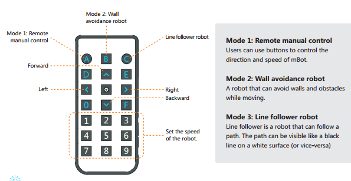

# Dependiendo del ordenador - Qué es

## DOS MODOS DE FUNCIONAR MBOT

Hay que tener en cuenta que mBot tiene dos formas de funcionar:

Dependiendo del ordenador y dos formas de conectarte:

- Conexión inalámbrica 2.4G (también puede ser Bluetooth, red.. pero no lo vamos a dar aquí pues provoca interferencias con otros equipos)
- Conexión por cable USB

Independiente del ordenador:

- Sólo por Conexión por cable USB se carga el programa (**Upload to Arduino)**, luego se desconecta y el robot ya puede ir sólo sin ordenador

Utilizaremos ****Dependiendo del ordenador conexión inalámbrica 2.4G****, por ser rápida y sencilla.

La conexión independiente del ordenador,  se explica en el M3 cómo realizarlo.

## ¿Qué hace mBot dependiendo del ordenador?

En el modo de dependiendo del ordenador, mBot obedece a un programa interno (**Firmware**) (que por cierto es bueno ir actualizándolo [ver](resetear_mbot.html))  Este **Firmware** lo que le ordena a la placa Arduino es:

1. Haz caso a las instrucciones del mando de IR ver figura de abajo
1. Haz caso a la conexión con el ordenador y a las instrucciones que vengan por ahí

Esto tiene su importancia: 

- El punto 1 te dice que no puedes hacer un programa con el Mando IR pues prevalece el del Firmware, por lo tanto no se puede utilizar en tu programación el mando IR en el modo "dependiendo del ordenador" pero sí en el modo "independiente del ordenador". 

- El punto 2 te dice que tus programas se ejecutan en el ordenador y se lo comunica al robot luego:

- Si desconectamos el ordenador o la conexión, dejan de funcionar, o mejor dicho se mBot se queda atascado en la última instrucción ejecutada.
- Tus programas van un poco lentos, pues dependen del ordenador. El mismo programa lo pasas al modo "independiente del ordenador" y va mucho más rápido.

Instrucciones del mando IR en el firmware que viene por defecto (modo dependiendo del ordenador):

**Fuente de las imágenes: [http://makeblock.es/](fuente:%20http://makeblock.es/)**

