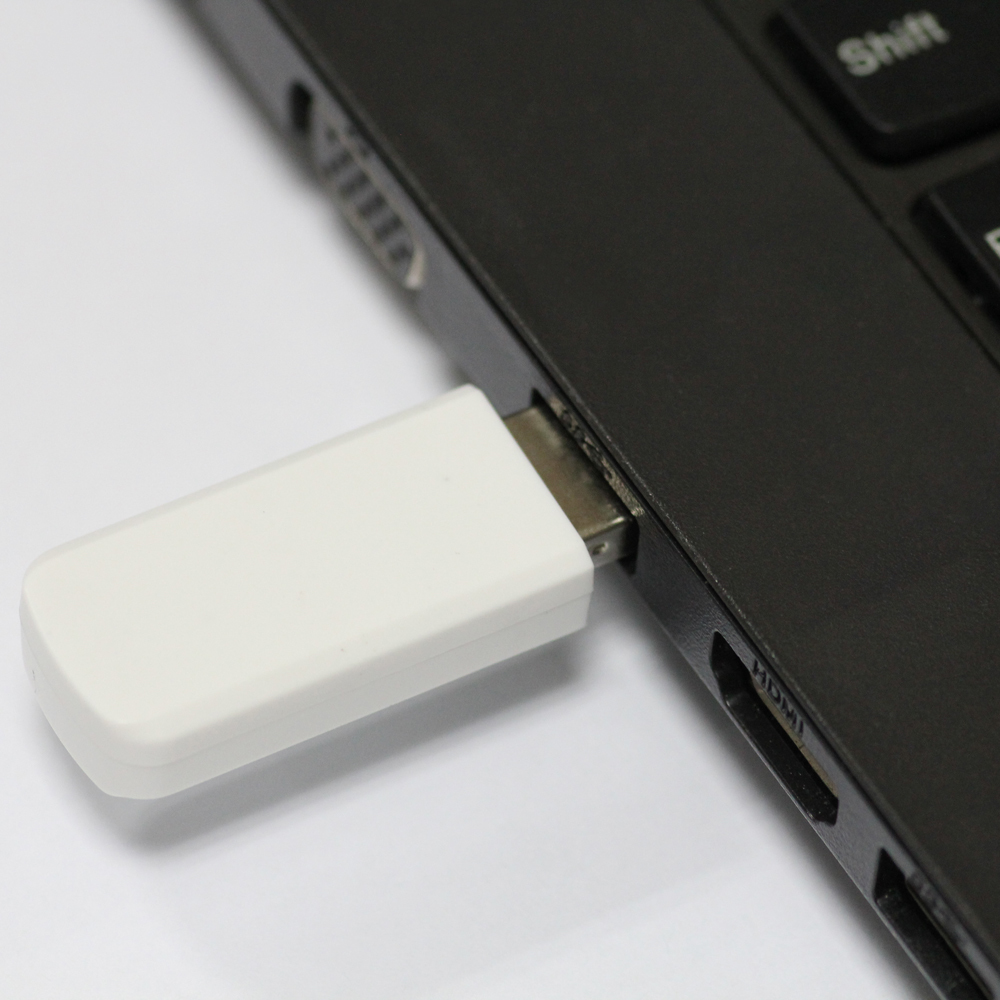
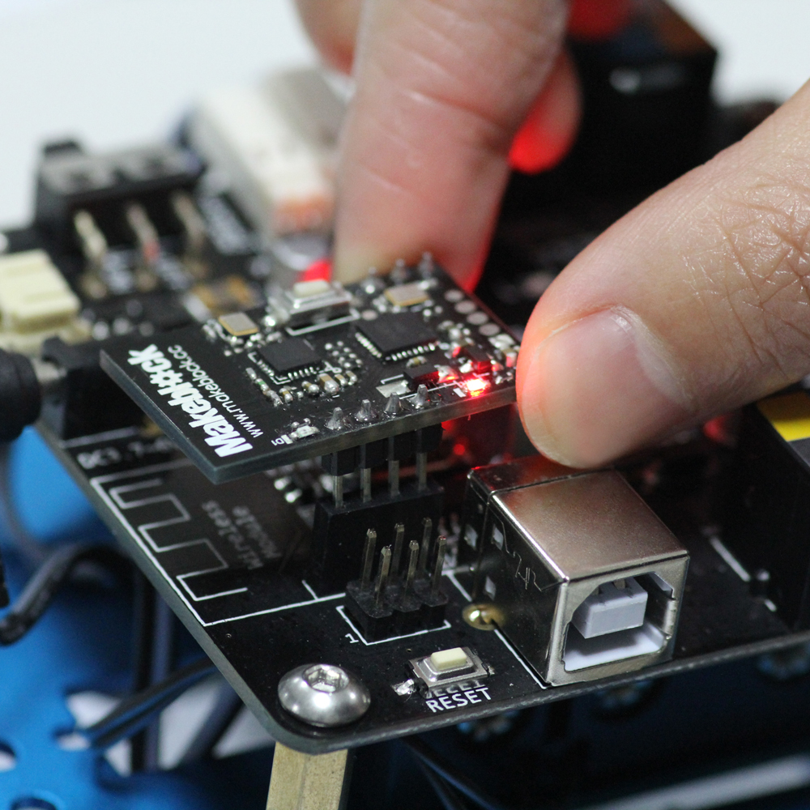
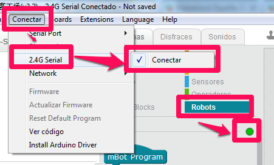
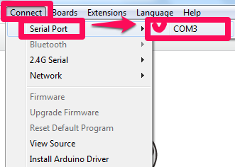
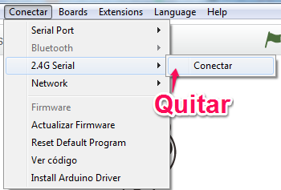

# Dependiendo del ordenador-Conexión

Tenemos dos opciones de comunicarnos con mBot, aconsejamos la primera:

Conexión inalámbrica 2.4G

La conexión inalámbrica se realiza a través de la [mochila 2.4G](http://www.makeblock.es/productos/mbot_usb_2.4g/). Insertamos el pincho USB de la mochila (no necesita ningún driver, el ordenador lo interpreta como un ratón inalámbrico). Cada pincho va asociado a un robot (o mejor dicho: La placa y el pincho de la [mochila 2.4G](http://www.makeblock.es/productos/mbot_usb_2.4g/) están emparejados, si el led de la mochila parpadea es que ha perdido conexión).

**Fuente de las imágenes: [http://makeblock.es/](fuente:%20http://makeblock.es/)**

y conectamos el robot con el programa en **Conectar- 2.4G Serial- Conectar** SI SE HA REALIZADO CORRECTAMENTE, EN EL CONJUNTO DE INSTRUCCIONES "Robots" CAMBIA EL PILOTO DE ROJO A VERDE es el mejor marcador para comprobar que la conexión está correcta:

 

## Conexión por cable

Existe la posibilidad de conexión por cable, útil por ejemplo si se ha perdido el pincho, seguir programando hasta la espera de la compra de otro, o por ejemplo si se agotan las pilas, por cable el robot puede seguir funcionando. Evidentemente con la pérdida de libertad de movilidad.

También la conexión por cable es necesaria si queremos que el robot funcione independiente del ordenador (ver Módulo 3)

No hay que olvidar que si optamos por la conexión Serial por el puerto USB, TENEMOS QUE DESCONECTAR LA OTRA CONEXIÓN INALÁMBRICA:

En este modo, también tiene que estar el piloto verde de las instrucciones Robots

Un vídeo resumen de todo:

https//www.youtube.com/watch?v=kiO8VYpIGsw
