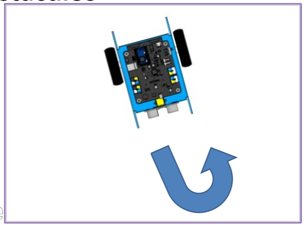
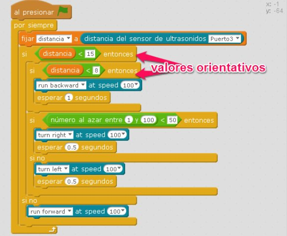

# Evitar obstáculos

## Reto Roomba

Programa al mBot para que sea capaz de evitar cualquier obstáculo, paredes... usando el sensor de ultrasonidos, aunque el del vídeo le ha puesto sirena!!

https//www.youtube.com/watch?v=ScN4D67fgLI

**Fuente: Autor**

%accordion%Solución%accordion%

Solución sencillota:

Solución super-avanzada:

**Fuente: Captura de pantalla mBlock. Programa: el autor.**

%/accordion%

Una opción es salir de un laberinto, [página descarga piezas 3D](http://www.thingiverse.com/thing:1169585)

Pero no le pongas cosas encima

<iframe src="https://giphy.com/embed/HqtdH0m61NBSg" width="480" height="270" frameBorder="0" class="giphy-embed" allowFullScreen></iframe>
<a href="https://giphy.com/gifs/baby-oscar-roomba-HqtdH0m61NBSg">via GIPHY</a>

