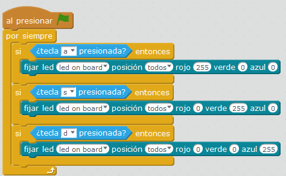

# LED RGB

Los LED que hay montados en la placa permiten poner los 3 colores básicos a distintas tonalidades, desde **0** hasta **255**, que podemos mezclar

###Reto
Realizar un programa que al apretar en el teclado..
* 'a' se encienda el rojo
* 's' se encienda el verde
* 'd' se enciena el azul

 https://www.youtube.com/watch?v=ZEmBMGpltw0 

%accordion%Solución%accordion%

**Fuente: Captura de pantalla mBlock. Programa: el autor.**

Ahora usa el teclado de tu ordenador, pulsa las teclas **a s** y **d**

%/accordion%

###¿No funciona?

Puede ser que mBot se quede enganchado con algún código anterior, la solución es [resetear mBot](http://aularagon.catedu.es/materialesaularagon2013/mbot/M1/resetear_mbot.html) y luego hacer el programa.

https//www.youtube.com/watch?v=ak8ppFNhJNg

