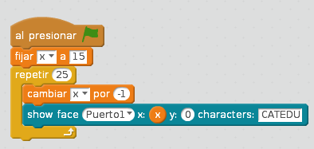

# Matriz Led

Con este simpática matriz, tenemos mucho juego:

## Enviar un dibujo

La instrucción es **show drawing** y si hacemos dos clicks nos permite poner el gráfico que queramos, incluso guardarlo en favoritos!

###Reto

Realizar un programa como en anterior pero en vez de huir, que sonria. Es decir, si pongo la mano delante sale una cara sonriente.

%accordion%Solución%accordion%

%/accordion%

Qué simpático ¿no?

<iframe src="https://giphy.com/embed/l41lYnl1Cw89JSsve" width="480" height="196" frameBorder="0" class="giphy-embed" allowFullScreen></iframe>
<a href="https://giphy.com/gifs/movie-1995-showgirls-l41lYnl1Cw89JSsve">via GIPHY</a>

## ¿No funciona?

Puede ser que mBot se quede enganchado con algún código anterior, la solución es [resetear mBot](http://aularagon.catedu.es/materialesaularagon2013/mbot/M1/resetear_mbot.html) y luego hacer el programa.

## Enviar un texto

Podemos enviar un texto, con la instrucción **show face**:

Esto envía en las coordenadas 0,0 la palabra CATEDU pero.... ¡¡**SALE CAT**!!

Claro ! no cabe!! ¿cómo lo hacemos? esto requiere más programación:

Nota: Aquí se trabaja con el concepto de **variables: Ves a Data&amp;Blocks y crea una variable x**

¿y si hacemos este programa?¿cómo sale las letras CATEDU?

Puedes probar con [este mensaje sofisticado](http://aularagon.catedu.es/materialesaularagon2013/mbot/M2/feliz2016-solo-texto.sb2)

## Enviar la hora

Pfff.... este curso es largo ¿qué hora es? que nos lo diga:

**Fuente de las imágenes: Capturas de pantalla mBlock. Programas: el autor.**

El robot no tiene reloj .. entonces ¿quien le dice la hora?

