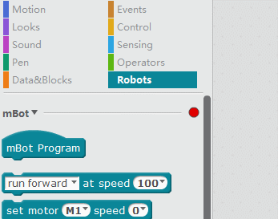

# mBot y mBlock

## Requisitos de conceptos previos

Es necesario haber realizado una **FORMACIÓN BÁSICA EN SCRATCH** la formación exclusiva de [Scratch ](https://scratch.mit.edu/)en [Aularagón ](http://aularagon.catedu.es/)es suficiente.

## Requisitos de material 

Necesitas el** kit de robótica mBot** de MakeBlock [que presta CATEDU](http://www.catedu.es/webcatedu/index.php/destacados/149-robotica) o que lo puedes conseguir comprándolo en las tiendas ver[ ¿qué es mBot?](qu_es_mbot.html)

Este curso utilizará dos productos:

<li>[mBot con mochila de comunicación 2.4G](http://www.makeblock.es/productos/robot_educativo_mbot_2.4g/). (La[ versión Bluetooth](http://www.makeblock.es/productos/robot_educativo_mbot/) no es recomendable en el aula, es mejor que tenga la [mochila 2.4G](http://www.makeblock.es/productos/mbot_usb_2.4g/))
<ul>
- Si no lo tienes montado, usa las [Instrucciones ](https://www.dropbox.com/s/kwfo7pjdjoyo2x3/mBot%20instruction.pdf?dl=1)del Kit mBot

## Requisitos de software y Hardware

Instalar el **mBlock** en la [página oficial de descarga mBlock](http://www.mblock.cc/). 

Disponible en diversos sistemas operativos y su instalación no presenta ningún problema.

- mBlock for PC: aconsejado para el aula, y recomendamos conexión 2.4G: **Windows, Mac, Linus, ChromeOS,. **
- mBlock for Mobile, que no aconsejamos para el aula porque necesita Bluetooth y se produce interferencias: Android,** iPad **.

Hemos probado mBlock en ordenadores viejos Windows XP y ha funcionado perfectamente. Es un programa que NO NECESITA INTERNET en su funcionamiento, por lo que se adapta a la realidad de todos los centros escolares.

Hay que destacar que en Windows, la primera vez que se quiere comunicar con el robot **salta el Firewall de Windows** bloqueándolo, pero mostrando un diálogo si se permite o no esta comunicación externa, clickar en **PERMITIR**. 

Se actualiza muy a menudo, mejorando cada vez más sus prestaciones, lo que implica que su descarga es cada vez más pesada, más de cien megas.

El programa es muy sencillo si estás acostumbrado al SCRATCH :

**Fuente: [http://makeblock.es/](Fuente:%20http://makeblock.es/)**

### Qué curioso

mBlock está basado en Scratch y simplemente ha añadido extensiones para trabajar mBot, pero también ha añadido extensiones para trabajar Arduino, no es capricho, es porque mBot es un Arduino con dos motores y sensores.

En CATEDU hemos experimentado distintas formas de programar el Arduino de forma sencilla para alumnos de primaria y encontramos mBlock como el mejor programa para hacerlo. Nuestro curso de [Arduino sin código](http://aularagon.catedu.es/materialesaularagon2013/arduino/index/) aprendes a programar Arduino de la misma forma que Scratch con mBlock.

### Para locos

El software mBlock permite añadir tus propias extensiones, [en este ejemplo](http://www.mecatronicalab.es/programando-el-robot-mario-con-mblock-scratch-arduino/) se ha creado un robot con Arduino y el autor ha creado extensiones para programarlo fácilmente igual que mBot arrastrando bloques tipo "Girar derecha rápido".

