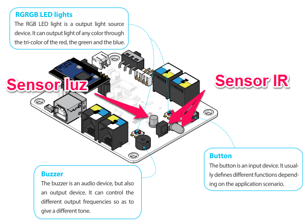

# Modulos electrónicos

En esta sección vamos a aprender los módulos que están integrados en la placa:

- Botón
- Led RGB
- Buzzer
- Sensor Infrarrojos
- Sensor de luz

Fuente : Modificado de [http://makeblock.es](http://makeblock.es/)

