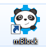
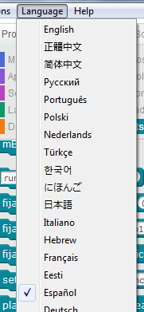
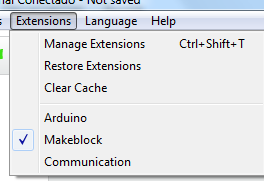
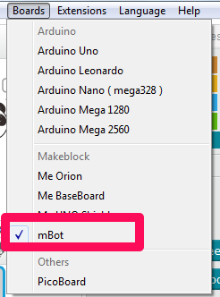

# Preparando mBlock

Ejecutamos **mBlock** ([página de descarga para instalarlo](mbot_y_mblock.html)) desde el menú o desde el icono instalado en el escritorio

Lo primero que podemos hacer es configurar el lenguaje: 

La opción de Extensión por defecto tiene que ser Makeblock:

Y la de la placa Board tiene que ser la de mBot:

y ya tenemos configurado nuestro programa. Estos parámetros no son necesarios volverlos a tocar cada vez que arrancamos mBlock

**Fuente de las imágenes: capturas pantalla mBlock**

