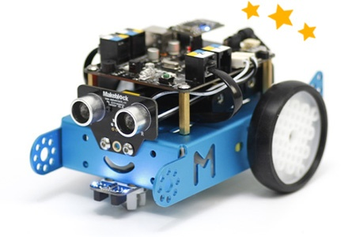

# ¿Qué es mBot?

mBot es un robot educativo de la empresa [Makeblock](http://www.makeblock.cc/), que persigue los siguientes objetivos:

1. El objetivo principal es** desarrollar el pensamiento computacional** en el alumnado motivado por la ejecución de órdenes en algo físico como es el robot.
1. El robot está diseñado para su** uso escolar**: resistente y económico
1. Basado en hardware **libre** y software **libre**

**El objetivo 1** da como resultado que el kit de mBot sólo permite una configuración posible más los complementos que tiene el kit que proporciona el kit de CATEDU, **no hay tiempos en construcción, sólo en programación**, esto es otra filosofía diferente frente a otras alternativas como los robots de [LEGO Mindstorm](http://mindstorms.lego.com/) o [LEGO WEDO](https://education.lego.com/es-es/lesi/elementary/lego-education-wedo) (LEGO WEDO es compatible con Scracth) que el tiempo en construcción y creatividad es importante. No queremos defender qué alternativa es buena y cual mala, sino que el docente tiene que decidir qué objetivos quiere perseguir, según lo que quiere tiene que decidir qué producto es el adecuado.

**El objetivo 2 **los precios y las características de este robot hace que sea un producto dirigido a los centros de enseñanza. Los distribuidores en España [son actualmente 3](http://www.makeblock.cc/distributors/), y en este curso tomaremos de referencia comercial [makeblock.es](http://www.makeblock.es/) pero perfectamente es válido los otros . **Las características y precios de mBot 2.4G se puede ver en [este enlace](http://www.makeblock.es/productos/robot_educativo_mbot_2.4g/)**.

**El objetivo 3 **el hardware libre está materializado en que se basa en la placa **ARDUINO**, que lo han personalizado con más sensores y conexiones rápidas RJ11 (la clavija de teléfono fijo). El software libre en este robot está en **el programa [mBlock](http://www.mblock.cc/)** que está basado en el software de programación **[Scracth](https://scratch.mit.edu/)**, diseñado para desarrollar el pensamiento computacional en los niños, ámpliamente usado en todo el mundo, el cual le añaden unas librerías propias del robot, dando como resultado [mBlock](http://www.mblock.cc/).  El software mBlock es el resultado de instalar el [firmware de la placa Arduino](http://app.makeblock.cc/firmware/), instalar las [librerías ](https://github.com/Makeblock-official/Makeblock-Library/archive/master.zip)del robot en el Scracth, [actualizar](http://learn.makeblock.cc/learning-scratch/#Step2-Upload-the-firmware), etc... recomendamos lo práctico: Descargar el **[mBlock](http://www.mblock.cc/)** diréctamente que lo tiene todo ya preparado. Dentro de esta filosofía de libertad, los agujeros son compatibles con LEGO ampliando las posibilidades.

Otras empresas que también apuestan con robótica educativa y hardware libre es la empresa española **BQ con [MundoMaker](http://www.bq.com/es/printbot-evolution) y [Zowi](http://www.bq.com/es/zowi)**, con otro software de programación: [BitBloq ](http://diwo.bq.com/course/aprende-robotica-y-programacion-con-bitbloq-2/)y [App de Zowi](https://play.google.com/store/apps/details?id=com.bq.zowi), y con hardware libre igual que mBot con ARDUINO. En BQ queremos destacar el apoyo al profesorado [Diwo](http://diwo.bq.com/).

**Fuente: [http://makeblock.es/](Fuente:%20http://makeblock.es/)**

