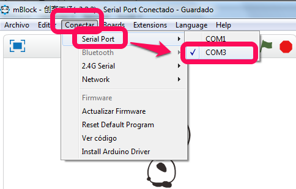
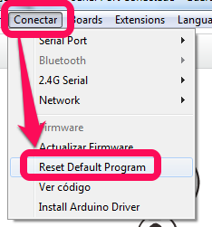

# Resetear mBot

## ¿Por qué?

¿Por qué a veces tenemos que resetearlo? por varias razones:

1. Por qué el mBot tiene un programa (es decir que se ha utilizado con el modo de cargar el programa en mBot, la opción Upload to Arduino) e impide su uso como **"dependiendo del ordenador"**
1. Por que el programa de mBot tiene algún resto que impide su uso correcto por ejemplo al usar las luces LED o la matriz LED..

## ¿Qué es?

Resetar mBot, significa dejarlo como estaba de fábrica es decir :

1. Esta preparado para usarlo "dependiendo del ordenador"
1. Hace caso al mando a distancia tal y como pone en [Dependiendo del ordenador - Qué es](dependiendo_del_ordenador__qu_es.html)

## ¿Cómo se hace?

1. conectamos el robot con el cable
1. en mBlock Conectar-Puerto serie- elegimos el último puerto que se ha creado al conectar el robot (en la foto COM3)
1. en mBlock Conectar-Reset Default Program

Fuente de las imágenes: Captura de pantalla de mBlock. Las fotos: El autor.

