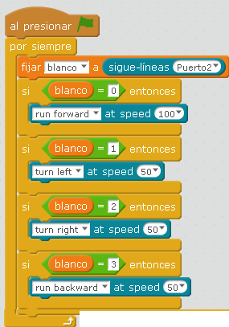

# Seguir un circuito

## Reto: Seguir una línea

El sigue-líneas no le hemos sacado potencial, pide a gritos que siga un circuito, en el kit impreso hay una propuesta de circuito, también te lo puedes descargarlo [aquí](https://www.dropbox.com/s/2oc3t7mu0nrklun/Line%20Follower%20Map%20-%20A2%20Size.pdf?dl=0) pero otra opción es con **cinta negra adhesiva** hacer en el suelo (tonos claros) **el circuito que queramos**, pero recomendamos poner **doble grosor**, sobre todo si mBot va rápido, pues se lo salta.

**ATENCIÓN**

NO SE PUEDE UTILIZAR EL MBOT EN ESTE PROGRAMA DEPENDIENDO DEL ORDENADOR, hay que utilizar la opción [Upload tu Arduino](upload_to_arduino.html), es decir, no ejecutar el programa en el ordenador, sino en el mBot, pues el retardo entre ordenador y mBot hace que salta de línea de vez en cuando.

¿cómo harías el programa?

Ten en cuenta que el sigue lineas, si devuelve 3 es que va por buen camino, si devuelve 1 habría que girar hacia la ... si devuelve 2 habría que girar hacia la ... y si devuelve 0 es que se ha ido, lo mejor es que des marcha atrás.

%accordion%Solución%accordion%

la respuesta de la puedes [descargar aquí](http://aularagon.catedu.es/materialesaularagon2013/mbot/M3/SIGUELINEAS.sb2) (sb2 - 66.49 <abbr lang="en" title="KiloBytes">KB</abbr>).

**Fuente: Captura de pantalla mBlock. Programa: el autor.**

%/accordion%

https//www.youtube.com/watch?v=bhkjOldya5E

