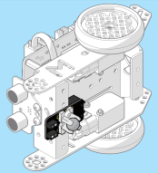
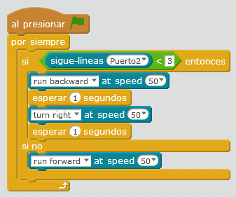

# Sensor de línea

El sensor de líneas está situado en la parte inferior de mBot:

Fuente: Tutorial de [http://makeblock.es](http://makeblock.es/)

Y tiene los siguientes valores:

* 0 si detecta todo negro (en binario 00)
* 1 si detecta blanco derecha pero negro a la izquierda (01)
* 2 al revés (10)
* 3 si detecta los dos blancos (11)

Fuente: Tutorial de [http://makeblock.es](http://makeblock.es/)

### Reto, la obeja en su redil

Ponemos a mBot en un [recuadro blanco con el borde negro (descarga A3)](http://aularagon.catedu.es/materialesaularagon2013/mbot/M2/A3-BordeExterior.pdf), queremos que hagas un programa que no salga nuestro robot del "_redil_".

>Consejo: Poner velocidad 100 pues si va rápido (255) se salta la línea.

https://www.youtube.com/watch?v=cgEejjvatlk

<iframe src="https://giphy.com/embed/8kkGIGAhor01W" width="480" height="270" frameBorder="0" class="giphy-embed" allowFullScreen></iframe>
<a href="https://giphy.com/gifs/sheep-8kkGIGAhor01W">via GIPHY</a>

%accordion%Solución%accordion%

**Fuente: Captura de pantalla mBlock. Programa: el autor.**
¿y si ponemos de velocidad 200 en run forward, qué pasaría?

%/accordion%

## Problemas: No funciona bien, se salta la línea

Esto es debido a que desde que mBot comunica a nuestro ordenador que ha detectado una línea negra, y por lo tanto el ordenador lo procesa, y manda la órden de dar marcha atrás y dar la vuelta... mBot ya se ha pasado de raya ... :(

Sobre todo en equipos viejos.

Solución: Hazlo independiente del ordenador. Mira cómo hacerlo en [M3 Upload to Arduino
](https://catedu.github.io/robotica-educativa-con-mbot/upload_to_arduino.html)
