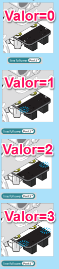

# Sensor de línea

El sensor de líneas está situado en la parte inferior de mBot:

Fuente: Tutorial de [http://makeblock.es](http://makeblock.es/)

Y tiene los siguientes valores:

Fuente: Tutorial de [http://makeblock.es](http://makeblock.es/)

Si por ejemplo ejecutamos este programa:

**Fuente: Captura de pantalla mBlock. Programa: el autor.**

Y ponemos a mBot en un [recuadro (descarga A3)](http://aularagon.catedu.es/materialesaularagon2013/mbot/M2/A3-BordeExterior.pdf), ¿qué haría?

¿y si ponemos de velocidad 200 en run foward?

## Problemas: No funciona bien, se salta la línea

Esto es debido a que desde que mBot comunica a nuestro ordenador que ha detectado una línea negra, y por lo tanto el ordenador lo procesa, y manda la órden de dar marcha atrás y dar la vuelta... mBot ya se ha pasado de raya ... :(

Sobre todo en equipos viejos

Solución: Hazlo independiente del ordenador. Mira cómo hacerlo en [M3 Upload to Arduino
](https://catedu.gitbooks.io/robotica-educativa-con-mbot/content/upload_to_arduino.html)
