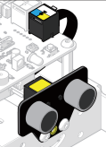
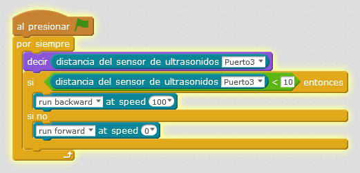

# Sensor distancia

El sensor de distancia por ultrasonidos nos devuelve por eco la **distancia en cm** del objeto que se encuentra enfrente, hasta un máximo de 400 cm

Fuente: Tutorial de [http://makeblock.es](http://makeblock.es/)

###Reto huir

Queremos que hagas un programa que si pongo la mano delante, que se vaya atrás. Por ejemplo a menos de 10cm.

%accordion%Solución%accordion%

**Fuente: Captura de pantalla mBlock. Programa: el autor.**

%/accordion%

Intenta cogerlo !!! (por delante claro)

<iframe src="https://giphy.com/embed/yRXnlNNC9U7FC" width="480" height="480" frameBorder="0" class="giphy-embed" allowFullScreen></iframe>
<a href="https://giphy.com/gifs/running-funny-silent-movie-yRXnlNNC9U7FC">via GIPHY</a>

