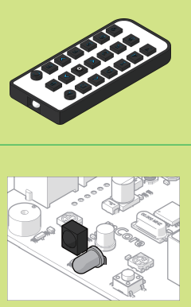
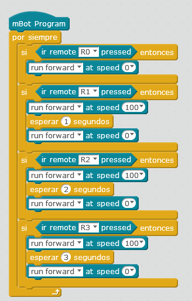

# Sensor IR

El sensor de IR puede recibir del mando números, letras A-D, flechas y el botón configuración. Ojo: El mando no es exclusivo de un robot, es decir, los demás robots del aula reciben las misma información, lo importante es apuntar el mando a los sensores del robot y no a otro:

Fuente: Tutorial de [http://makeblock.es](http://makeblock.es/)

Realizar programas con el sensor de IR tiene una dificultad:** NO SE PUEDE HACER A TRAVÉS DEL ORDENADOR** es decir, no se puede realizar como lo hemos hecho hasta ahora: Bandera y comunicación entre PC y mBot ¿Por qué? porque el mBot tiene instalado en esta configuración el programa por defecto **Firmware** de leer el mando, y no podemos saltarlo. **Ver M1 Dos formas de funcionar mBot.**

¿Cómo pues? Utilizando la otra configuración:** mBot independiente del ordenador**, con la desventaja de no poder interactuar con los elementos de Scracth, para usar este modo, hay que consultar el [M3 en el apartado** Upload to Arduino**](https://catedu.github.io/robotica-educativa-con-mbot/upload_to_arduino.html): ¿te atreves a ser un alumno avanzado?

##Reto
Vamos que puedes hacerlo bailar !!

https://www.youtube.com/watch?v=9Q8_KgLinpg

%accordion%Solución%accordion%

**Fuente: Captura de pantalla mBlock. Programa: el autor.**

%/accordion%

