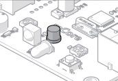

# Sensor Luz

El sensor Luz está situado al lado de los de IR, detecta la luz ambiente, pero también hemos experimentado que detecta la infrarroja, por lo que es sensible a la calefacción, y falsea su medida.

Fuente: Tutorial de [http://makeblock.es](http://makeblock.es/)

### Un reto muy visual

Realizar un programa que si iluminamos al robot ¡¡se pone a dar vueltas!! sino, se queda quieto:

https://www.youtube.com/watch?v=1ypZ9gAjQn4

%accordion%Solución%accordion%

**Fuente: Captura de pantalla mBlock. Programa: el autor.**

El valor umbral de 500 hay que modificarlo según la luz ambiental que exista, por eso está el comando "Decir sensor de luz" para que nuestro amigo oso panda que hay en el programa mBlock nos diga los valores de luz que hay, observamos los valores, y según si tapamos o no el robot, decidimos qué valor umbral ponemos.

%/accordion%

Es muy espectacular hacerlo con los alumnos, se deja el aula a oscuras, se encienden todas las luces y todo baia !

Si quieres que el pobre salga de marcha por la noche:

https//www.youtube.com/watch?v=p9543Fjx4sM

