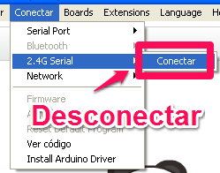
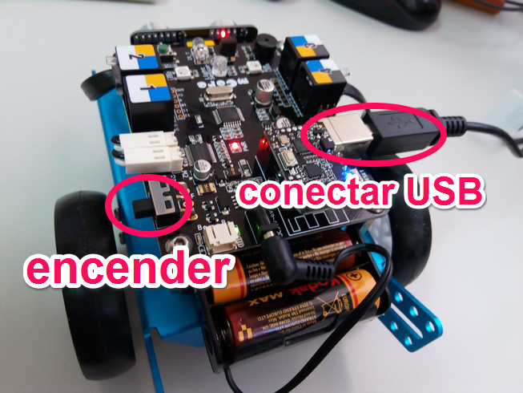
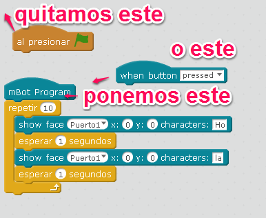
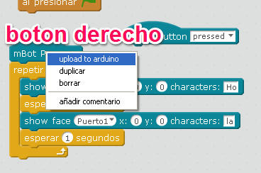
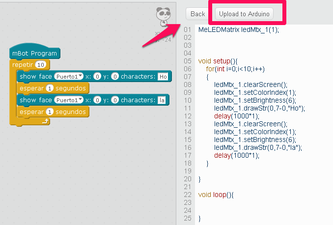
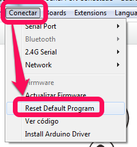
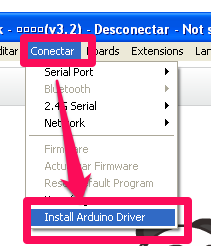
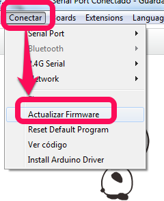

# Upload to Arduino

## ¿Por qué?

Si queremos que nuestro programa funcione **independiente** del ordenador, es decir grabar nuestro programa en el Arduino del mbot, y que funcione, claro!

También si queremos que nuestro mBot funcione más rápido, mejor o si "Dependiendo del ordenador" no hace las cosas del todo bien.

## Esto tiene una pega

En nuestro programa no podemos utilizar ningún comando propio de Scratch, es decir por ejemplo en **Aparencia "Decir Hello"** pues corresponde al personaje "panda" del programa Scratch-mBlock

## ¿Cómo se hace?

- Desconectamos nuestro mbot del ordenador, la conexión inalámbrica que teníamos

- Conectamos el mbot con el cable USB y encendemos:

- Conectamos el mblock con mbot por el puerto serie, automáticamente pone el puerto que ha detectado, porque antes hemos dado a instalar el driver del Arduino, será el último puerto que se ha instalado (en la foto COM3):

- Cambiamos en nuestro programa el comienzo del programa (el de la bandera) por uno propio del robot:

- Con el botón derecho, pinchamos en el mBot program y elegimos Upload Arduino, o más fácil en **Editar- Modo Arduino**:

- Se nos abrirá una ventana con el CODIGO PARA GRABARLO EN EL ARDUINO DEL ROBOT, incluso PODEMOS MODIFICAR LO QUE QUERAMOS,  le damos a UPLOAD TU ARDUINO

CURIOSIDADES: El código que aparece a la derecha es código de Arduino, lo podemos modificar si sabemos, y si no sabemos... pues podemos hacer nuestros atrevimientos ¿qué pasaría si en el anterior código cambiamos SetBrightness(6) por SetBrightness(3) ? pues que la matriz brilla menos!!

- **YA ESTÁ** si dice un mensaje de que se ha grabado correctamente PODEMOS FUNCIONAR EL PROGRAMA DEL ROBOT SIN EL ORDENADOR ENCENDIDO!!, podemos quitar el cable usb y nuestro robot funciona independiente.

## Al terminar, deja las cosas como estaban, 

No sea que el siguiente quiera utilizar el robot de forma "dependiendo del ordenador" y se encuentra que funciona con tu programa

Tenemos que QUITAR EL PROGRAMA que hemos instalado sino no puede volver a conectarse con el mBlock usando la bandera por ejemplo.

- Conectar el cable (ver paso 2)
- Conectar mBlock por el puerto serie (ver paso 3)
- Reseteamos el arduino, esto quitará nuestro programa y pone deja el robot como estaba antes:

**Fuente de las imágenes: Captura de pantalla de mBlock. Las fotos: El autor.**

¿te has liado? no me extraña, un vídeo a ver si te aclaras:

https//www.youtube.com/watch?v=ZxVw-auuYho

## ¿Y si hay algún problema?

Puede ser que nuestro Windows no reconozca mBot (o sea, no reconozca la placa Arduino) para eso, instalamos el Arduino Driver en nuestro programa mBlock:

## ¿Y si siguen los problemas?

Por si acaso han sacado una nueva actualización vamos a **Actualizar el firmware**:

1. Conectamos el robot con el cable y encendemos
1. En mBlock Conectar-Puerto serie- elegimos el último puerto que se ha creado al conectar el robot (en la foto COM3)
1. En mBlock Conectar-Actualizar firmware

